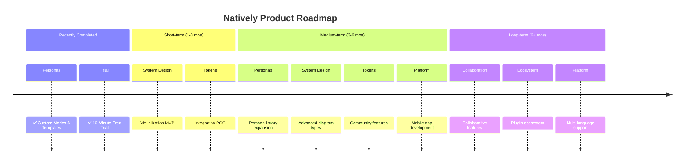

## Cluegent Source, License, and Modifications

Cluegent is a modified AGPL-3.0 application based on the Natively open-source project. Our public source code is available at [admincluegent/cluegent-app](https://github.com/admincluegent/cluegent-app), and the license is available at [LICENSE](LICENSE).

Cluegent modifications include product branding, Firebase authentication and backend Functions, server-managed STT and LLM integrations, Razorpay subscription billing, Firestore entitlement and usage tracking, website/legal pages, local meeting history, customizable AI behavior, quick actions, and production-focused UI updates.

See [ATTRIBUTION.md](ATTRIBUTION.md) for upstream attribution, license notes, and a concise summary of included Cluegent changes.

## Deploying Your Own Cluegent Instance

This repository contains source code only. It does not include production API keys, Firebase service accounts, Razorpay secrets, webhook secrets, or private environment files.

To deploy your own instance, create your own Firebase project and provider accounts, then configure the required secrets yourself. Use [.env.example](.env.example) as the placeholder template, and set Firebase Functions secrets with `firebase functions:secrets:set SECRET_NAME`.

Required backend secrets for the current Cluegent flow:

- `DEEPSEEK_AI_API_KEY` for text-only LLM responses.
- `GEMINI_API_KEY` for screenshot-attached responses.
- `ASSEMBLY_AI_API_KEY` for realtime speech-to-text tokens.
- `RAZORPAY_TEST_KEY_ID`, `RAZORPAY_TEST_KEY_SECRET`, and `RAZORPAY_TEST_WEBHOOK_SECRET` for Razorpay test billing.
- `RAZORPAY_TEST_ALLOWED_EMAILS` to restrict test billing access.
- `RAZORPAY_TEST_PLAN_PRO_MONTHLY`, `RAZORPAY_TEST_PLAN_PRO_YEARLY`, `RAZORPAY_TEST_PLAN_POWER_MONTHLY`, and `RAZORPAY_TEST_PLAN_POWER_YEARLY` for subscription plan mapping.

Security notes:

- Never commit `.env`, service-account JSON files, Firebase admin credentials, private keys, API keys, or webhook secrets.
- Keep provider keys in Firebase Secrets or your deployment platform's secret manager.
- Public client Firebase config values may be present in app builds, but Firestore/Functions security must rely on Firebase Auth, backend checks, and server-side secrets.
- Generated outputs such as `dist/`, `dist-electron/`, `functions/lib/`, `.firebase/`, and `node_modules/` should not be used as the source-of-truth for AGPL source availability.

# [Sponsored by Recall AI - API for desktop recording](https://docs.recall.ai/docs/desktop-sdk?utm_source=github&utm_medium=sponsorship&utm_campaign=evinjohnn-natively-ai-assistant)

If you’re looking for a hosted desktop recording API, consider checking out [Recall.ai](https://docs.recall.ai/docs/desktop-sdk?utm_source=github&utm_medium=sponsorship&utm_campaign=evinjohnn-natively-ai-assistant), an API that records Zoom, Google Meet, Microsoft Teams, in-person meetings, and more.

<div align="center">
  

# Natively / Cluegent - Open-Source Desktop AI Meeting Assistant

**A local-first assistant for meeting notes, live context, screenshots, and technical learning.**
<br/>
**Open source, privacy-focused, and designed for permitted professional and learning workflows.**
<br/>


<br/>

[](LICENSE)
[](https://github.com/Natively-AI-assistant/natively-cluely-ai-assistant/releases)
[](https://github.com/Natively-AI-assistant/natively-cluely-ai-assistant/releases)

[](https://github.com/Natively-AI-assistant/natively-cluely-ai-assistant)

[](https://x.com/i/communities/2031398735515693507)

> **Cluegent is built for permitted productivity workflows.** You control the app, the enabled providers, and the context you choose to share.

<p align="center">
  <a href="https://natively.software">
    
  </a>
</p>

<p align="center">
  <a href="https://github.com/Natively-AI-assistant/natively-cluely-ai-assistant/releases/latest">
    
  </a>
  <a href="https://github.com/Natively-AI-assistant/natively-cluely-ai-assistant/releases/latest">
    
  </a>
</p>

<small>Requires macOS 12+ (Apple Silicon & Intel) or Windows 10/11</small>

<br/>

**<span style="color: #ef4444">Open source</span>** &nbsp;·&nbsp; **<span style="color: #f97316">Local-first</span>** &nbsp;·&nbsp; **<span style="color: #22c55e">BYOK friendly</span>** &nbsp;·&nbsp; **<span style="color: #3b82f6">Fast responses</span>** &nbsp;·&nbsp; **<span style="color: #a855f7">Privacy-focused</span>**

</div>

---

## Open-Source Desktop AI Assistant

Natively is the upstream open-source desktop assistant that Cluegent builds on. It provides a private overlay, realtime transcription, screenshot-aware prompts, local meeting history, and bring-your-own-model support.

Cluegent adds product branding, Firebase authentication, entitlement tracking, billing integration, website/legal pages, and production-focused UI updates. The project is intended for lawful, permitted meeting, learning, accessibility, and productivity workflows.

## What Users Are Saying

> "This is a fantastic piece of software and you should definitely keep up the great work! This is exactly what I was looking for. I started out trying the open-source version, and because it worked so well, I decided to go ahead and buy the full premium license."  
> - **Oskar Krzak**

> "The response time and screen analysis are very fast. The latency is practically non-existent."
> - **Premium User**

> "It helps me keep live context, summarize discussions, and quickly understand shared screens during technical conversations."
> - **User Feedback**

## Why Natively?

Natively is a native intelligence system for live meetings, learning sessions, and technical conversations.

- **Native Audio Capture (<500ms):** Built with Rust and Zero-Copy ABI transfers for low-latency transcription.
- **Dual-Channel Intelligence:** Distinct pipelines for system audio and microphone input.
- **User-Controlled Overlay:** Keep the assistant available on your desktop and use it only where AI assistance is permitted.
- **Rolling Context:** Maintain a memory window of the active conversation for more useful answers.
- **Local RAG Memory:** Embed meetings locally using SQLite vector search so you can ask about past decisions.
- **Custom Personas & Reference Docs:** Use tailored AI behavior and local reference files for the context you provide.
- **Rich Dashboard:** Manage, search, and export your local history.
- **Offline Capable:** Run with local Ollama models when configured.

## 3 things to know before choosing a desktop AI assistant

1. **Local-first architecture matters.** Meeting transcripts, screenshots, and reference files can include sensitive information, so Cluegent emphasizes local history and user-controlled providers.
2. **Bring-your-own-model keeps you flexible.** You can connect supported cloud models or run local models with Ollama where appropriate.
3. **Responsible use is required.** Cluegent is for permitted meetings, learning, accessibility, and productivity. Do not use it to violate interview, exam, platform, school, workplace, or legal rules.

<div align="center">

### ⭐ Star this repo — it matters

Every star helps developers and teams discover a free, private, local-first assistant for meetings, learning, and technical productivity.

[](https://github.com/Natively-AI-assistant/natively-cluely-ai-assistant)

</div>

---

## Demo


This demo shows **a complete live meeting scenario**:

- Real-time transcription as the meeting happens
- Rolling context awareness across multiple speakers
- Screenshot analysis of shared slides
- Instant generation of what to say next
- Follow-up questions and concise responses
- All happening live, without recording or post-processing

---

## Feature Overview

| Feature | Natively / Cluegent |
| :-- | :-- |
| Open source core | AGPL-3.0 source availability |
| Local meeting history | Searchable transcripts, prompts, screenshots, and responses |
| Realtime transcription | Low-latency system audio and microphone pipelines |
| Screenshot understanding | Vision model support for shared screens, slides, and code snippets |
| Custom AI behavior | Separate behavior settings for listening, typed prompts, and screenshots |
| Resume/reference context | Local PDF, DOCX, and TXT context for relevant permitted questions |
| Bring your own key | Supported provider configuration for flexible model choices |
| Local AI option | Ollama support for offline/private workflows |
| Responsible use | Intended only for lawful, permitted productivity and learning workflows |

## Why Natively wins

Natively combines live transcription, screenshot-aware prompts, local history, and configurable AI providers in one desktop workflow. It is useful for meetings, classes, presentations, technical planning, and accessibility support where AI assistance and transcription are allowed.

### Privacy-first workflow

By default, local history stays on your machine. Provider requests are made only when you enable and use the relevant transcription, AI, or screenshot features.

### Flexible model support

Use supported cloud providers for convenience or local models through Ollama for offline/private workflows.

### Technical learning support

Use screenshots, transcripts, and reference files to ask for explanations, debugging help, summaries, and next-step suggestions in permitted coding and learning environments.

> **Responsible use:** Cluegent is not intended to violate proctoring, monitoring, platform restrictions, interview rules, academic rules, workplace policy, or legal requirements.

## Natively API (Hosted Tier)

**Stop managing four separate services. One key. Zero configuration.**

Are you managing separate accounts for your AI reasoning, live transcription, fast inference, and web search? Juggling multiple API keys, rate limits, and invoices across completely different categories of tools is unnecessary overhead. Natively API replaces all of those categories with **one flat subscription**.

Under the hood, Natively API connects you to the absolute best models for the optimal user experience:

- **Backend AI Models**: Claude, OpenAI, Gemini, and Groq.
- **Premium STT Models**: Google Chirp 2/3, ElevenLabs Scribe v2, and Deepgram Nova-3.

### 4 Categories → 1 Key

**Your current unbundled stack:**

- **AI Intelligence (GPT/Claude/Gemini):** per-token billing and usage anxiety
- **Lightning-Fast Inference (Groq/Llama):** strict rate limits to monitor
- **Real-Time Transcription (Deepgram/Google STT):** separate key + quota
- **Web Search & Research (Tavily/Perplexity):** yet another subscription

**Replaced by Natively API:**

- **AI chat, transcription & web search** — all included
- **One flat subscription.** Zero surprise bills. Starts at $8/mo.
- **Single key.** Zero rotation. Zero configuration.

### API Plan Comparison

| Feature                               | Standard ($8/mo) | Pro ($15/mo) | Max ($25/mo) | Ultra ($35/mo) |
| :------------------------------------ | :--------------- | :----------- | :----------- | :------------- |
| **All-in-One Cloud AI Access**        | ✅ Yes           | ✅ Yes       | ✅ Yes       | ✅ Yes         |
| **Real-Time Transcription**           | ✅ Yes           | ✅ Yes       | ✅ Yes       | ✅ Yes         |
| **Included Natively Pro Desktop App** | ❌ No            | ✅ Yes       | ✅ Yes       | ✅ Yes         |
| **Premium Support**                   | ❌ No            | ✅ Yes       | ✅ Yes       | ✅ Yes         |
| **Higher Monthly Quotas**             | ❌ No            | ✅ Yes       | ✅ Yes       | ✅ Yes         |

**Don't start the long way.** Skip the 20-minute manual setup. One Natively subscription skips all of it — AI, transcription, and web search are ready immediately.

<p align="center">
  <a href="https://checkout.dodopayments.com/buy/pdt_0NbFixGmD8CSeawb5qvVl">
    
  </a>
  <a href="https://checkout.dodopayments.com/buy/pdt_0NcM6Aw0IWdspbsgUeCLA">
    
  </a>
  <a href="https://checkout.dodopayments.com/buy/pdt_0NcM7JElX4Af6LNVFS1Yf">
    
  </a>
  <a href="https://checkout.dodopayments.com/buy/pdt_0NcM7rC2kAb69TFKsZnUU">
    
  </a>
</p>

---

## Natively Pro

While Natively is **free and open-source forever**, we also offer a **Pro Edition** (available as **Lifetime or Yearly** subscriptions) designed for power users, teams, and professionals. Purchasing a Pro license unlocks advanced productivity features while directly supporting the continued development of the open-source Natively core.

### Free vs Pro Feature Comparison

| Feature                                             | Natively Free | Natively Pro |
| :-------------------------------------------------- | :-----------: | :----------: |
| **Bring Your Own Key (BYOK) Models**                |      ✅       |      ✅      |
| **Local AI Support (Ollama)**                       |      ✅       |      ✅      |
| **Real-Time Speech-to-Text (<500ms)**               |      ✅       |      ✅      |
| **Live Contextual Assistant**                       |      ✅       |      ✅      |
| **Screenshot & Slide OCR Analysis**                 |      ✅       |      ✅      |
| **User-Controlled Overlay Settings**                |      Yes      |      Yes     |
| **Meeting Dashboard & Offline RAG History**         |      ✅       |      ✅      |
| **Job Description (JD) & Resume Context Awareness** |      ❌       |      ✅      |
| **Automated Company Research & Dossiers**           |      ❌       |      ✅      |
| **Live Salary & Offer Negotiation Copilot**         |      ❌       |      ✅      |
| **Custom Persona Modes (Sales, Tech, etc.)**        |      ❌       |      ✅      |
| **Custom Real-Time Context & Reference Files**      |      ❌       |      ✅      |
| **Priority Feature Access & Support**               |      ❌       |      ✅      |

<p align="center">
  <a href="https://checkout.dodopayments.com/buy/pdt_0NbHo6EnXlNPqNcZ14OTi">
    
  </a>
  <a href="https://checkout.dodopayments.com/buy/pdt_0NcM4QBwy0CDcPV9CXaNP">
    
  </a>
</p>

---

### What's New in v2.5.0

Version 2.5.0 introduces major feature upgrades, architectural overhauls, and robust stability fixes:

- **Custom Persona Modes**: Completed Custom Modes (Technical Learning, Sales, Recruiting, Team Meet, Lecture, etc.) allowing tailored AI personas and behaviors.
- **Dynamic Note Templates**: AI now dynamically generates highly structured meeting notes based on the active persona mode (e.g., Problem Statement, Follow-ups, Space & Time Complexity for technical learning).
- **Reference Files & Custom Context**: Deeply integrate PDFs, DOCX files, and custom text instructions into the AI's real-time prompt logic.
- **10-Minute Free Trial**: A new free trial system lets you experience Natively API with built-in HWID+IP anti-abuse protections and seamless upgrade paths.
- **Reliable Screenshot Capture**: Hardened and completely stable multi-screenshot capture with single-trigger `Cmd+Shift+Enter` analysis.
- **Custom Provider Enhancements**: Custom cURL endpoints now completely support automatic meeting summaries and custom AI behaviors without breaking the prompt injection strategy.
- **STT Connection Pools & Resilience**: Added round-robin connection pools for Deepgram and ElevenLabs with exponential backoff and shadow-probe failover, absolutely eliminating 1006 reconnect storms.
- **Redesigned Premium UI**: Apple-tier designs applied across the Modes Pro Gate, Permissions Toaster, Free Trial Modals, and settings overlays using hardware-accelerated animations.
- **Robust Webhook Billing**: Hardened API subscriptions webhook verifications and payment processing to properly coordinate Standard, Pro, Max, and Ultra API plans.

---

## Table of Contents

- [Open-Source Desktop AI Assistant](#open-source-desktop-ai-assistant)
- [What Users Are Saying](#what-users-are-saying)
- [Why Natively?](#why-natively)
- [3 things to know](#3-things-to-know-before-choosing-a-desktop-ai-assistant)
- [Demo](#demo)
- [Feature Overview](#feature-overview)
- [Why Natively wins](#why-natively-wins)
- [Natively Pro](#natively-pro)
- [What's New in v2.4.0](#whats-new-in-v240)
- [Privacy & Security](#privacy--security-core-design-principle)
- [Installation](#installation-developers--contributors)
- [AI Providers](#ai-providers)
- [Key Features](#key-features)
- [Meeting Intelligence Dashboard](#meeting-intelligence-dashboard)
- [Roadmap](#roadmap)
- [Use Cases](#use-cases)
- [Technical Details](#technical-details)
- [Known Limitations](#known-limitations)
- [Responsible Use](#responsible-use)
- [Contributing](#contributing)
- [License](#license)
- [FAQ](#faq)
- [Alternatives Natively replaces](#alternatives-natively-replaces)
- [Star History](#star-history)

---

## What Is Natively?

**Natively** is a **desktop AI assistant for live situations**:

- Meetings
- Permitted interview preparation and coaching
- Presentations
- Classes
- Professional conversations

It provides:

- Live answers
- Rolling conversational context
- Screenshot and document understanding
- Real-time speech-to-text
- Instant suggestions for what to say next

All while remaining fast, user-controlled, and privacy-first.

---

## Privacy & Security (Core Design Principle)

- 100% open source (AGPL-3.0)
- Bring Your Own Keys (BYOK)
- Local AI option (Ollama)
- All data stored locally
- Limited anonymous telemetry (basic GA4 counts)
- No user data tracking
- No hidden uploads

You explicitly control:

- What runs locally
- What uses cloud AI
- Which providers are enabled

---

## Installation (Developers & Contributors)

> [!NOTE]
> **macOS Users (Both Apple Silicon & Intel Macs supported):**
>
> 1.  **"Unidentified Developer"**: If you see this, Right-click the app > Select **Open** > Click **Open**.
> 2.  **"App is Damaged"**: If you see this, run the command in Terminal based on your download:
>
>     **For .zip downloads:**
>
>     ```bash
>     xattr -cr /Applications/Natively.app
>     ```
>
>     **For .dmg downloads:**
>     1. Open Terminal and run:
>        ```bash
>        xattr -cr ~/Downloads/Natively-2.0.2-arm64.dmg # Or your specific filename
>        ```
>     2. Install the natively.dmg
>     3. Open Terminal and run: `xattr -cr /Applications/Natively.app`

### Prerequisites

- Node.js 22.x
- Git
- Rust (required for native audio capture)

### AI Credentials & Speech Providers

**Natively is 100% free to use with your own keys.**  
Connect **any** speech provider and **any** LLM. No subscriptions, no markups, no hidden fees. All keys are stored locally.

### Unlimited Free Transcription (Whisper, Google, Deepgram)

- **Soniox** (API Key) - _Ultra-fast, highly accurate streaming STT_
- **Google Cloud Speech-to-Text** (Service Account)
- **Groq** (API Key)
- **OpenAI Whisper** (API Key)
- **Deepgram** (API Key)
- **ElevenLabs** (API Key)
- **Azure Speech Services** (API Key + Region)
- **IBM Watson** (API Key + Region)

### AI Engine Support (Bring Your Own Key)

Connect Natively to **any** leading model or local inference engine.

| Provider                     | Best For                                                    |
| :--------------------------- | :---------------------------------------------------------- |
| **Gemini 3.1 Series**        | Recommended: Massive context window (2M tokens) & low cost. |
| **OpenAI (GPT-5.4 & o3)**    | High reasoning capabilities.                                |
| **Anthropic (Claude 4.6)**   | Coding & complex nuanced tasks.                             |
| **Groq (Llama 3.3/Scout 4)** | Insane speed (near-instant answers) & screenshot analysis.  |
| **Ollama / LocalAI**         | 100% Offline & Private (No API keys needed).                |
| **OpenAI-Compatible**        | Connect to _any_ custom endpoint (vLLM, LM Studio, etc.)    |

> **Note:** You only need ONE speech provider to get started. We recommend **Google STT** ,**Groq** or **Deepgram** for the fastest real-time performance.

---

#### To Use Google Speech-to-Text (Optional)

Your credentials:

- Never leave your machine
- Are not logged, proxied, or stored remotely
- Are used only locally by the app

What You Need:

- Google Cloud account
- Billing enabled
- Speech-to-Text API enabled
- Service Account JSON key

Setup Summary:

1. Create or select a Google Cloud project
2. Enable Speech-to-Text API
3. Create a Service Account
4. Assign role: `roles/speech.client`
5. Generate and download a JSON key
6. Point Natively to the JSON file in settings

---

## Development Setup

### Clone the Repository

```bash
git clone https://github.com/Natively-AI-assistant/natively-cluely-ai-assistant.git
cd natively-cluely-ai-assistant
```

### Use The Correct Node Version

This repo now targets **Node.js 22** for local development and Firebase Functions.

```bash
node -v
```

Expected result:

```bash
v22.x.x
```

The repo includes both `.nvmrc` and `.node-version` pinned to `22` so version managers and editors can detect the correct runtime automatically.

If your local machine is still on Node 20, upgrade to a Node 22 release before installing dependencies. On Windows, the simplest reliable route is to install a Node 22.x release directly from the official Node.js website:

- https://nodejs.org/en/download/releases/

### Install Dependencies

```bash
npm install
```

### Build Native Audio Module (Rust)

```bash
npm run build:native
```

### Environment Variables

Create a `.env` file:

```env
# Cloud AI
GEMINI_API_KEY=your_key
GROQ_API_KEY=your_key
OPENAI_API_KEY=your_key
CLAUDE_API_KEY=your_key
GOOGLE_APPLICATION_CREDENTIALS=/absolute/path/to/service-account.json

# Speech Providers (Optional - only one needed)
DEEPGRAM_API_KEY=your_key
ELEVENLABS_API_KEY=your_key
AZURE_SPEECH_KEY=your_key
AZURE_SPEECH_REGION=eastus
IBM_WATSON_API_KEY=your_key
IBM_WATSON_REGION=us-south

# Local AI (Ollama)
USE_OLLAMA=true
OLLAMA_MODEL=llama3.2
OLLAMA_URL=http://localhost:11434

# Default Model Configuration
DEFAULT_MODEL=gemini-3.1-flash-lite-preview
```

### Run (Development)

```bash
npm start
```

### Build (Production)

```bash
npm run dist
```

This runs: Vite build → TypeScript compile → native module build → electron-builder

---

### AI Providers

- **Custom (BYO Endpoint):** Paste any cURL command to use OpenRouter, DeepSeek, or private endpoints.
- **Ollama (Local):** Zero-setup detection of local models (Llama 3, Mistral, Gemma).
- **Dynamic Model Selection:** Preferred models (OpenAI, Anthropic, Google) now automatically appear across the app.
- **Google Gemini:** First-class support for the Gemini 3.1 series.
- **OpenAI:** GPT-5.4 and o3 series support with optimized system prompts.
- **Anthropic:** Claude 4.6 series support with corrected max_tokens.
- **Groq:** Ultra-fast text inference with Llama 3.3, and screenshot analysis using Llama 4 Scout.

---

## Key Features

### Desktop Assistant

- Always-on-top translucent overlay
- Instantly hide/show with shortcuts
- Works across all applications

### Real-time Meeting Context & Coding Help

- Real-time speech-to-text (**<500ms latency**)
- **Fast Response Mode**: Ultra-fast text responses using Groq Llama 3.3.
- **Multilingual Support**: Choose from various response languages, and set speech recognition matching specific accents and dialects.
- **Concise Persona System**: Refined system prompts help responses stay concise, conversational, and suited to the selected workflow.
- Context-aware Memory (RAG) for Past Meetings
- Instant answers as questions are asked
- **Interim/Final Bridging**: Manual transcript finalization and interim bridging during active sessions for higher accuracy.
- Smart recap and summaries
- **Dynamic Note Templates**: AI automatically generates structured meeting notes based on your active persona mode (e.g., Tech Interview follow-ups vs Sales action items).

### Instant Screen & Slide Analysis (OCR) — AI Coding Interview Assistant

- Works with shared screens, slides, code editors, documents, and browser-based learning environments where assistance is permitted
- Capture a coding problem with one shortcut — get a full solution, explanation, and complexity analysis instantly
- User-controlled overlay and screenshot capture for your local desktop workflow
- Multiple screenshot support for multi-part problems
- Smart fallback to Groq Llama 4 Scout if primary vision model fails

### Premium Profile Intelligence

- **Custom Persona Modes**: Seamlessly switch between built-in personas (Technical Interview, Sales, Recruiting) or create your own custom modes tailored to any conversation.
- **Reference Files & Custom Context**: Upload PDFs, DOCX files, or type custom instructions to give the AI real-time context on your specific situation.
- **Resume & Reference Context**: Natively can use your local resume or reference files to provide more relevant permitted answers.
- **Organization Research**: Get contextual notes about the company, customer, or organization you are discussing.
- **Negotiation Assistance**: Real-time guidance and strategy during offer and salary negotiations.

### Contextual Actions

- What should I answer?
- Shorten response
- Recap conversation
- Suggest follow-up questions
- Manual or voice-triggered prompts

### Dual-Channel Audio Intelligence

Natively understands that _listening_ to a meeting and _talking_ to an AI are different tasks. We treat them separately:

- **System Audio (The Meeting):** Captures high-fidelity audio directly from your OS (fully supported on both macOS and Windows). It "hears" what your colleagues are saying without interference from your room noise.
- **Sample Rate Auto-Detection**: Dynamically detects and syncs true hardware sample rates (e.g., automatically handling 48kHz audio interfaces or external microphones without distortion or downsampling artifacts).
- **Two-Stage Silence Processing**: Combines adaptive RMS thresholds with **WebRTC Machine Learning VAD** to reject typing and fan noise.
- **Microphone Input (Your Voice):** A dedicated channel for your voice commands and dictation. Toggle it instantly to ask Natively a private question without muting your meeting software.

### Spotlight Search & Customization

- Global activation shortcut (`Cmd+K` / `Ctrl+K`)
- **Custom Key Bindings**: Customize global shortcuts for easier control.
- Instant answer overlay
- Upcoming meeting readiness

### Local RAG & Long-Term Memory

- **Full Offline RAG:** All vector embeddings and retrieval happen locally (SQLite + `sqlite-vec`).
- **Semantic Search:** innovative "Smart Scope" detects if you are asking about the current meeting or a past one.
- **Sliding-Window RAG**: 50-token semantic overlap to prevent context loss across chunk boundaries.
- **Epoch Summarization**: Smarter transcript memory management instead of hard truncation — no more losing early meeting context.
- **Global Knowledge:** Ask questions across _all_ your past meetings ("What did we decide about the API last month?").
- **Automatic Indexing:** Meetings are automatically chunked, embedded, and indexed in the background.

### Advanced Privacy & Controls

- **Cross-Window State Sync**: Real-time state synchronization across Settings, Launcher, and Overlay windows.
- **Security Hardening**: API keys are scrubbed from memory on app quit and credentials manager overwrites key data before disposal.
- **API Rate Limiting**: Token-bucket algorithm (burst/refill) to prevent 429 errors on free-tier providers.
- **Local-Only Processing:** All data stays on your machine.

---

## Meeting Intelligence Dashboard

Natively includes a powerful, local-first meeting management system to review, search, and manage your entire conversation history.


- **Meeting Archives:** Access full transcripts of every past meeting, searchable by keywords or dates.
- **Smart Export:** One-click export of transcripts and AI summaries to **Markdown, JSON, or Text**—perfect for pasting into Notion, Obsidian, or Slack.
- **Usage Statistics:** Track your token usage and API costs in real-time. Know exactly how much you are spending on Gemini, OpenAI, or Claude.
- **Audio Separation:** Distinct controls for **System Audio** (what they say) vs. **Microphone** (what you dictate).
- **Session Management:** Rename, organize, or delete past sessions to keep your workspace clean.

---

## Roadmap



<div align="center">
  <em>For detailed feature descriptions, see our full <a href="ROADMAP.md">ROADMAP.md</a>.</em>
</div>

---

## Use Cases

### Academic & Learning

- **Live Assistance:** Get explanations for complex lecture topics in real-time.
- **Translation:** Instant language translation during international classes.
- **Problem Solving:** Immediate help with coding or mathematical problems.

### Professional Meetings

- **Interview Support:** Context-aware prompts to help you navigate technical questions.
- **Sales & Client Calls:** Real-time clarification of technical specs or previous discussion points.
- **Meeting Summaries:** Automatically extract action items and core decisions.

### Development & Technical Work

- **Code Insight:** Explain unfamiliar blocks of code or logic on your screen.
- **Debugging:** Context-aware assistance for resolving logs or terminal errors.
- **Architecture:** Guidance on system design and integration patterns.

---

## Architecture Overview

Natively processes audio, screen context, and user input locally, maintains a rolling context window, and sends only the required prompt data to the selected AI provider (local or cloud).

No raw audio, screenshots, or transcripts are stored or transmitted unless explicitly enabled by the user.

---

## Technical Details

### Tech Stack

- **React, Vite, TypeScript, TailwindCSS**
- **Electron**
- **Rust** (native audio with **Zero-Copy ABI Transfers** via `napi::Buffer` — enabling continuous audio capture without V8 garbage collection pressure, achieving significantly lower latency and CPU usage than typical Electron-based competitors)
- **SQLite** (local storage with `sqlite-vec`)

### Supported Models

- **Gemini 3.1 Series**
- **OpenAI** (GPT-5.4, o3 series)
- **Claude** (4.6 series)
- **Ollama** (Llama, Mistral, CodeLlama)
- **Groq** (Llama 3.3 for text, Llama 4 Scout for OCR)

### System Requirements

- **Minimum:** 4GB RAM
- **Recommended:** 8GB+ RAM
- **Optimal:** 16GB+ RAM for local AI

---

## Responsible Use

Natively is intended for:

- Learning
- Productivity
- Accessibility
- Professional assistance

Users are responsible for complying with:

- Workplace policies
- Academic rules
- Local laws and regulations

This project does not encourage misuse or deception.

---

## Known Limitations

- Linux support is limited and actively looking for maintainers
- Initial setup requires bringing your own API keys or installing Ollama
- No built-in mock practice mode (focus is on live, real-time assistance)

---

## Contributing

Contributions are welcome! Please see our [CONTRIBUTING.md](CONTRIBUTING.md) for full guidelines on how to get started.

- Bug fixes
- Feature improvements
- Documentation
- UI/UX enhancements
- New AI integrations

Quality pull requests will be reviewed and merged.

### Maintainers

| Maintainer                                 | Role          | Support                                                                                                                                                                     |
| ------------------------------------------ | ------------- | --------------------------------------------------------------------------------------------------------------------------------------------------------------------------- |
| [@evinjohnn](https://github.com/evinjohnn) | macOS Build   | [](https://www.buymeacoffee.com/evinjohnn) |
| [@razllivan](https://github.com/razllivan) | Windows Build | [](https://app.lava.top/razllivan)         |

---

## License

Licensed under the GNU Affero General Public License v3.0 (AGPL-3.0).

If you run or modify this software over a network, you must provide the full source code under the same license.

This repository contains the open-source core of the project.

Some features available in official releases are part of the
commercial Premium Edition and are not included in this repository.

> **Note:** This project is available for sponsorships, ads, or partnerships – perfect for companies in the AI, productivity, or developer tools space.

---

**Star this repo if Natively helps you with meetings, learning, or presentations.**

---

## FAQ

#### Is Natively really free?

Yes. Natively is an open-source project. You only pay for what you use by bringing your own API keys (Gemini, OpenAI, Anthropic, etc.), or use it **100% free** by connecting to a local Ollama instance.

#### Does Natively work with Zoom, Teams, and Google Meet?

Yes. Natively uses a Rust-based system audio capture that works universally across any desktop application, including Zoom, Microsoft Teams, Google Meet, Slack, and Discord.

#### Is my data safe?

Natively is built on **Privacy-by-Design**. By default, all transcripts, vector embeddings (Local RAG), and keys are stored locally on your machine. We collect only limited anonymous telemetry (no personal user data).

#### Can I use it for interview preparation?

Yes, for preparation, coaching, mock practice, and permitted professional use. Do not use Natively or Cluegent to violate interview, exam, platform, workplace, school, or legal requirements.

#### How do I use local models?

Simply install **Ollama**, run a model (e.g., `ollama run llama3`), and Natively will automatically detect it. Enable "Ollama" in the AI Providers settings to switch to offline mode.


#### Does Natively violate proctoring or platform restrictions?

No. Natively and Cluegent are not designed to violate proctoring, monitoring, platform restrictions, interview rules, academic rules, workplace policy, or legal requirements. Use the app only where AI assistance, transcription, screenshots, and note-taking are allowed.

#### Can it help with code understanding?

Yes, in permitted learning and development environments. Screenshot OCR and AI responses can help explain visible code, summarize errors, suggest debugging steps, and discuss complexity.

---

## Alternatives Natively Replaces

Natively can be used as a local-first alternative to common meeting and productivity tools:

| Category | What Natively provides |
| :-- | :-- |
| Meeting notes | Local transcripts, summaries, and searchable history |
| AI notetaking | User-controlled transcription and AI responses |
| Screen understanding | Screenshot-aware explanations for slides, docs, and code |
| Local AI workflows | BYOK provider setup and Ollama support |
| Productivity assistants | Quick actions, custom behavior, and contextual prompts |

## Support Natively

The community around **Natively** created a Pump.fun token to support the project.

Creator rewards help cover **AI/API bills** and ongoing development costs.

<p align="center">
  <a href="https://pump.fun/coin/B5opQ9euCVcJALeeCQbrFv5kePG8cCcoYqnXfx4Ppump">
    
  </a>
</p>

---

## Star History

<a href="https://star-history.com/#evinjohnn/natively-cluely-ai-assistant&Date">
 <picture>
   <source media="(prefers-color-scheme: dark)" srcset="https://api.star-history.com/svg?repos=evinjohnn/natively-cluely-ai-assistant&type=Date&theme=dark" />
   <source media="(prefers-color-scheme: light)" srcset="https://api.star-history.com/svg?repos=evinjohnn/natively-cluely-ai-assistant&type=Date" />
   
 </picture>
</a>

<!-- SEO: desktop AI assistant ? AI meeting assistant ? local-first meeting notes ? open-source meeting assistant ? realtime transcription ? screenshot understanding ? privacy-first productivity tool ? electron AI assistant -->

<sub>desktop-ai-assistant ? ai-meeting-assistant ? meeting-notes ? realtime-transcription ? screenshot-understanding ? local-ai ? ollama ? byok ? rag ? electron ? rust ? privacy-first ? open-source</sub>
